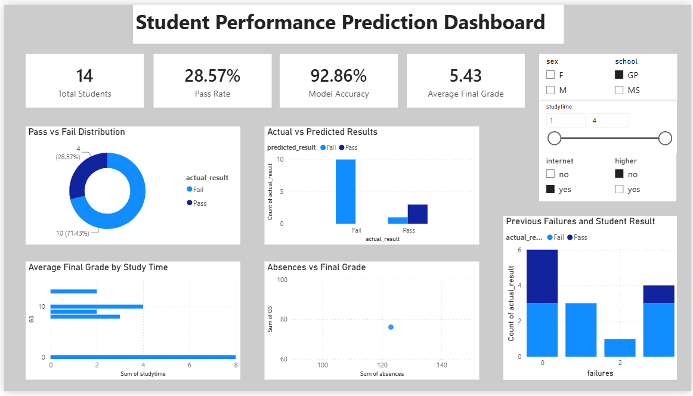

# Student Performance Prediction Using Machine Learning

This project predicts whether a student will pass or fail based on academic and personal factors using Python and machine learning. It also includes a Power BI dashboard to visualize student performance patterns and model results.

## Tools Used
- Python
- pandas
- Scikit-learn
- Power BI
- VS Code
- GitHub

## Project Steps
1. Loaded and explored the student performance dataset.
2. Created a pass/fail target column using the final grade.
3. Converted categorical data into numeric format.
4. Trained Logistic Regression and Random Forest models.
5. Evaluated model performance using accuracy, confusion matrix, and classification report.
6. Exported prediction results to CSV.
7. Built a Power BI dashboard to visualize performance insights.

## Dashboard

## Key Features
- Pass/fail prediction
- Actual vs predicted result comparison
- Model accuracy calculation
- Study time and grade analysis
- Absences and final grade analysis
- Interactive Power BI slicers

## Files
- `student_prediction.py` - Python machine learning code
- `outputs/student_predictions.csv` - Data exported for Power BI
- `powerbi/student_performance_dashboard.pbix` - Power BI dashboard file
- `screenshots/dashboard.png` - Dashboard preview

## Dataset
The dataset used is the Student Performance dataset from the UCI Machine Learning Repository.